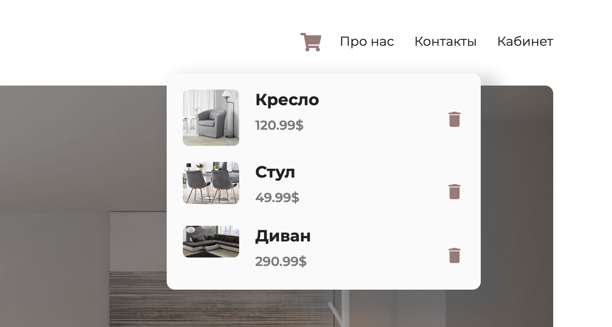
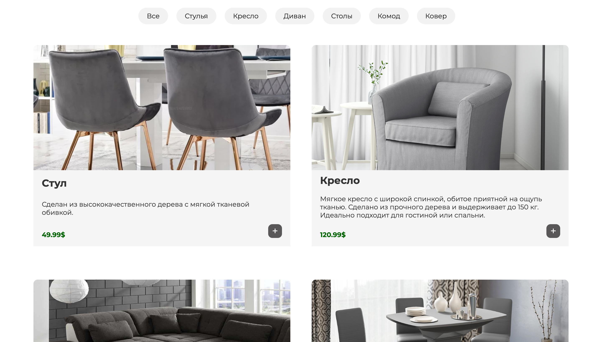

# 🌟 Household Goods Online Store 🌟

A fully responsive e-commerce website built with **React.js**, **JavaScript (ES6+)**, **HTML5**, **CSS3**, and **Bootstrap** for selling household goods.

## 🚀 Features

- **🔍 Product Filtering & Sorting**  
  Users can filter and sort products by various criteria, making it easier to find exactly what they're looking for.

- **🛒 Shopping Cart**  
  Seamlessly add, remove, and adjust the quantity of items in the cart. The cart is dynamically updated in real-time.

- **📦 Category-Based Navigation**  
  Browse products by categories such as kitchenware, furniture, decor, and more.

- **🔗 React Router Integration**  
  Smooth navigation between the product details and shopping cart pages using React Router.

- **💻 Responsive Design**  
  Optimized for mobile and desktop devices to provide a great user experience on any screen size.

- **⚡ Efficient State Management**  
  Application state is managed using **React Hooks** and **Context API**, ensuring efficient data flow and scalability.

## 🛠 Technologies Used

- **React.js**: For building the user interface and components.
- **JavaScript (ES6+)**: Leveraging modern JavaScript features like arrow functions, async/await, and more.
- **HTML5 & CSS3**: Semantic markup and modern styling techniques.
- **Bootstrap**: Responsive grid system and UI components for a polished look.
- **React Router**: For handling page navigation.
- **React Hooks & Context API**: For managing the state and ensuring component reusability and maintainability.

## 📦 Installation

To run the project locally, follow these steps:

1. Clone the repository:
   ```bash
   git clone https://github.com/yourusername/household-goods-store.git
2. Navigate into the project directory:
   ```bash
   cd household-goods-store
3. Install dependencies:
   ```bash
   npm install
4. Start the development server:
   ```bash
   npm start
5. Open your browser and go to http://localhost:3000 to view the app.
   
## 🛍 Usage
- **Browse Categories:** Explore products by category (e.g., kitchen, furniture, decor).
- **Filter and Sort:** Narrow down your options by filtering and sorting products.
- **Add to Cart:** Easily add products to your cart, adjust quantities, and remove items.
- **Product Details:** View detailed information about each product.
- **Checkout:** Proceed with the checkout to complete your order.

## 📸 Screenshots
  
  
  

## 💡 Check out the live version of the app!
## 🔗 Live Demo
You can try the application in action by following this https://yogurtt77.github.io/ReactShop/

